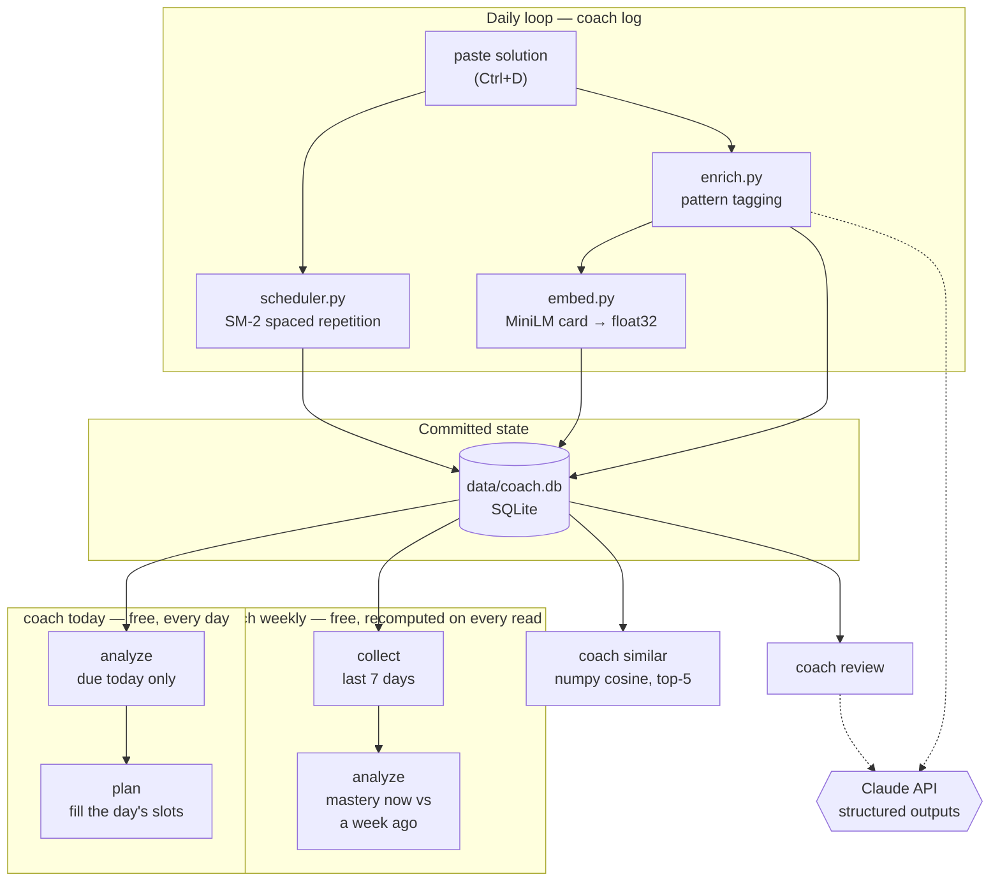

# leetcode-coach

A personal interview-prep coach that closes the loop on LeetCode practice: it remembers
what you solved and *how*, tells you when to re-solve it, retrieves your own past
solutions by algorithmic pattern, and plans each day around your measured weaknesses.

The practice problem it fixes: solving 20–30 problems a week leaks. There is no record
of which patterns are strong, no signal when a problem was "solved" without learning
what it teaches, and no schedule that brings a problem back before you forget it.

Everything the LLM does here is **measured**, not assumed — see
[Does it actually work?](#does-it-actually-work) below.

---

## Architecture



Solid arrows are local; dotted arrows are the only places an LLM is involved. Every one
of them degrades to a working non-LLM path when the API is unavailable.

---

## What it does

| Command | What it gives you |
|---|---|
| `coach today` | **The daily entry point.** Today's problems, in priority order |
| `coach log <n>` | Paste a solution → stores it, tags the pattern, embeds it, schedules the review, shows similar past solves, and flags the solve if you used the wrong approach |
| `coach due` | What to re-solve today, by spaced repetition |
| `coach similar <n>` / `--paste` | Your five most similar past solutions, by *algorithmic pattern* rather than text |
| `coach review <n>` | Structured feedback on a stored solution: what it got right, complexity, bugs, edge cases, better approach. Stored after the first run, so looking again is free |
| `coach stats` | Pattern coverage, mastery scores, struggle rates, off-pattern solves, curriculum progress |
| `coach weekly` | The last seven days: every solve, and whether each pattern you used is going well, needs work, or has too little history to call |
| `coach enrich` | Backfills tags and embeddings for anything logged while offline |
| `coach-web` | The same data in a browser: progress, a table of your practiced patterns, a form to log a solve, today's list, and this week in review |

---

## Web UI

```bash
uv sync --extra web
uv run coach-web        # http://127.0.0.1:8000
```

Four pages, no build step — FastAPI serving plain HTML/CSS/JS:

- **Home** — solved count, reviews due, clean-solve rate, curriculum progress; a table of
  distinct problems solved per pattern (a problem counts under *every* pattern you have
  practised it with, so solving one problem two ways credits both); and an *I solved a question*
  form that runs the exact `coach log` code path — attempt, SM-2 reschedule, tagging, embedding,
  similar-solve lookup, the off-pattern notice, and where that pattern now stands.
- **Solutions** — every problem you have logged, newest first; open one to read each solve's code
  exactly as you pasted it, with its outcome, timing, pattern and complexity. Each solve can carry
  a review — what it got right, what to improve, your complexity against optimal — stored once and
  shown for free thereafter. Asking for a new one is always an explicit click, never something
  opening the page pays for.
- **Daily Plan** — the browser version of `coach today`: today's focus topics (weak patterns, stale
  patterns, off-pattern solves) and today's problems in priority order, each with the reason it was
  picked. Recomputed live on every load and read-only.
- **Weekly Review** — the last seven days: every solve with its outcome and pattern, then each
  pattern you practised with its all-time mastery, its standing, and how much this week moved it.
  A pattern is only called *needs work* or *going well* once it has enough history to judge —
  below that it says so instead of guessing. Recomputed on every load like everything else, so
  logging a solve changes it immediately. It diagnoses only; what to solve is on **Daily Plan**.

The CLI and the web UI share one implementation ([`coach/service.py`](coach/service.py)); the web
layer only translates it to JSON. Degradation is the same too — with no API key a solve still
saves, and the page says the enrichment is pending.

`COACH_DB=/tmp/scratch.db` points any command, `coach-web` included, at a throwaway database.
`COACH_WEB_HOST` / `COACH_WEB_PORT` move the server; it binds to localhost by default and has
no authentication, so keep it there.

---

## Design decisions

**Two tag layers, because "solved" and "learned" are different questions.**
Each solution gets a `pattern` describing *the approach as written* — even when that
approach is a brute force. Each problem separately gets an `intended_pattern`: the
canonical optimal approach. Tagging your solution honestly is what keeps struggle
analytics truthful; if a brute-forced Maximum Subarray were filed under `dp-1d`, the
planner would never schedule the one thing you most need to learn. The **disagreement
between the layers** is the useful signal: it marks a problem you solved without
learning what it teaches, and the planner forces a re-solve.

**A problem can have more than one canonical approach.**
Best Time to Buy and Sell Stock is a one-pass greedy *and* a textbook 1-D DP; solving it
either way is solving it properly. So a problem carries `intended_secondary_patterns`
alongside its central `intended_pattern`, and the two feed two different signals. The
sharp one, *off-pattern*, now fires only when a solve used **none** of the accepted
approaches — no more forced re-solves for taking the other legitimate route. The soft one
is a note ("this problem can also be solved with: dp-1d") shown on every solve, off-pattern
or not, that lists the canonical approaches you have not practised here. It costs nothing:
both are set arithmetic over columns the enrichment call already filled in. Because it is
computed when you look rather than frozen when the solve was stored, widening a problem's
canonical set later widens the note on old solves too.

**One mastery score per pattern, not a struggle rate.**
"Weak" used to mean *at least half the attempts were not clean* — a binary that read five
shaky-but-solved sweeps exactly like five failures. It now means a mastery score below
2.5/5 over at least five attempts. Each solve scores `0.7 · outcome + 0.3 · review`, on the
same 1–5 scale SM-2 already uses for scheduling: the outcome is self-report (how it felt),
the review is the external judgement on the code (a bug scores 1, a missed boundary 2, and
extra findings can only pull it down). They disagree often enough to be worth both — a solve
can feel clean and still carry a bug. Scores fold through an exponential moving average
(α = 0.2), so recent solves move the number without erasing history, and the table is
rebuilt by replaying attempts rather than updated in place — a review usually arrives days
after the solve it judges, and replay is what lets it count.

**No per-problem file mirror.** Early versions also wrote each solve to
`solutions/NNNN-slug.py`, so the repo doubled as a browsable archive without needing to
open the database. It was removed once it became clear nothing in the application ever
read those files back — `coach.db` already stores every attempt in full, not just the
latest, so the mirror was pure duplication, kept alive only for a reader outside the
tool (git, GitHub, a human). That's a real audience, but not one worth writing every
solve to disk twice for; `coach.db` is the only copy now.

**A controlled vocabulary of 26 patterns, enforced as a type.**
The model picks from an enum, so tags can never fragment into `dp`/`DP`/`dynamic
programming` and make coverage analytics meaningless. LeetCode's own tags are kept too,
but for the opposite job — they are coarse enough to *find new problems*, while our
vocabulary is fine enough to *diagnose weaknesses*.

**Embed an enriched card, not raw code.**
Each solution is embedded as `title + pattern + key trick + code`, so two problems that
share a technique retrieve each other even when they share no vocabulary. Measured, not
assumed: see the retrieval eval below (it wins, but only modestly).

**No vector database.**
Brute-force numpy cosine over float32 blobs in SQLite. At a few hundred solutions this
takes microseconds; a vector DB would be infrastructure bought to solve a problem this
project does not have.

**Nothing about the week is written down.**
The weekly review used to be a once-a-week pipeline: it wrote `reports/YYYY-WW.md`,
stored a frozen snapshot of that week's numbers, and paid for one LLM call to narrate
them. Both halves aged badly. The snapshot was stale the moment the next problem was
solved — the same failure that had already killed the frozen weekly *plan* — and the
narrative was the one output nothing ever read back, since what it advised was a
restatement of numbers the tables beside it already showed. Both are gone. `coach
weekly` and the Weekly Review page now run the same SQL on demand, so the week is
correct by construction rather than as of whenever it was last generated, and no
scheduler, no report file and no API key are involved in looking at it.

**Comparison instead of narration.**
The question the note was there to answer — *is this pattern getting better?* — is a
subtraction, not a paragraph. Mastery is already a replay of every scored attempt, so
replaying it a second time up to the start of the window gives what the pattern scored
a week ago, and the difference is the answer. It is exact, it costs nothing, and unlike
prose it cannot be vague.

**Everything degrades.**
No API key, rate limit, refusal, or network failure ever loses a logged solve. `coach
log` stores the solution and queues enrichment, then `coach enrich` backfills the tags
and embeddings later. Only enrichment and `coach review` ever call the API at all.

---

## Does it actually work?

The point of the eval harness is that "the feedback looked good" is not a claim you can
defend or iterate against. Full numbers and methodology: **[evals/RESULTS.md](evals/RESULTS.md)**.

### Review feedback — 43 fixtures

| Metric | Result |
|---|---|
| Recall on planted flaws | **97%** (29/30) |
| False-positive rate on clean controls | **0%** (13 controls) |
| By category | bug 94% · complexity 100% · edge-case 100% |

These numbers were measured on `review-v2`. The shipped prompt is now `review-v3`, which
adds a `strengths` field so a review also says what the solution got right; its
issue-detection has not been re-scored, and the table stands as a v2 result until it is.

The false-positive rate matters as much as recall: a reviewer that reports five issues
on every solution scores perfect recall and is useless, because it would send you
re-solving problems you already got right.

**Ground truth comes from executing the code, never from an opinion.** Canonical
solutions are mutated using a taxonomy of common mistakes fixed in advance, then run
against a test harness. A mutant that fails a representative input is a `bug`; one that
fails only at a boundary is an `edge-case`; one that is correct but ≥5× slower at scale
is a `complexity` flaw; and one the tests cannot distinguish from the original is
**discarded**. That discard rule means weak tests cost fixtures rather than producing
mislabelled ones — the safe direction to fail. It also means the author of a planted
flaw is not the authority on whether it is real.

### The result worth reading

**Two prompt iterations produced no measurable improvement.** `review-v1` and
`review-v2` tie at 29/30; they differ only in *which* fixture they miss, and both misses
are the same defensible dispute about where "bug" ends and "edge-case" begins.

What actually moved the number from 93% to 97% was **fixing the eval** — three
independent defects in the ground truth, every one found because the model disagreed
with a label and the disagreement turned out to be its point:

1. Inputs marked as boundary cases that were nothing of the kind (different-length
   strings are an ordinary input to an anagram check).
2. Tests that violated the problem's own constraints — empty arrays fed to problems
   whose constraints state `1 <= length`. A defect on an input the problem excludes is
   not a defect. Removing those tests made three mutants indistinguishable from the
   original, and the oracle discarded them on its own.
3. A "clean" control that was not clean: it iterated `prices[1:]`, allocating an O(n)
   copy, and the model was scored as a false positive *for being right about it*.

### Pattern tagging and retrieval

| Eval | Result |
|---|---|
| `intended_pattern` vs NeetCode's published Blind 75 sections (measured on `enrich-v2`) | **100%** (29 problems) |
| Retrieval recall@5 — enriched cards | **64%** |
| Retrieval recall@5 — raw code | 60% |

Enriched cards beat raw code by 5 points: a real win, but a **weak** one, and reported
as such. Both variants fail on the same cluster, where four labelled 1-D DP pairs
compete for five result slots in a corpus dense with DP problems.

Known limitations — small `edge-case` sample, an array/string/DP-only bank, and the
fact that mutation *choice* remains authored even though every label is executed — are
listed in [evals/RESULTS.md](evals/RESULTS.md#known-limitations).

---

## Quick start

Requires Python 3.12 and [uv](https://docs.astral.sh/uv/).

```bash
uv sync --extra embed          # omit --extra embed to skip torch (no local embeddings)
uv sync --extra web            # optional: FastAPI + uvicorn for the browser UI
cp .env.example .env           # then add your key; .env is gitignored
uv run coach init              # download the catalog, create the database

uv run coach today                            # what to solve today (free, no LLM)
uv run coach log 1 --outcome clean --time 8   # paste your solution, then Ctrl+D
uv run coach due
uv run coach similar 1
uv run coach-web                              # the same data in a browser
```

Development:

```bash
uv run pytest                  # every LLM call mocked, API key stripped
uv run ruff check .
uv run python -m evals.validate_bank        # re-label the fixture bank, no API calls
uv run python -m evals.run_evals --all --dry-run   # count the calls and cost first
uv run python -m evals.run_evals --all             # real API calls
```

`--dry-run` reports the calls a real run would make and an estimated cost before anything
is spent — it counts them with the same code the run buys them with, so the two cannot
disagree. Evals run on `config.EVAL_MODEL`, which is the model the coach itself uses; pass
`--model` to score a different one. Responses cache by prompt version, model, and a digest
of the code they scored, so a repeat run costs nothing, correcting a *label* re-scores for
free, and editing a *fixture* re-buys just that fixture.

The database starts empty and grows from your first `coach log`. `data/coach.db` is
gitignored on purpose: it holds your practice history, not the tool, so cloning this repo
gives you a clean database of your own rather than someone else's solves. It is the only
copy of that history — nothing in git backs it up for you.

---

## No automation, by design

Nothing here runs unattended. There is no cron job, no systemd timer, and no scheduled
writer, because there is nothing left to schedule: the weekly review is computed the
moment you ask for it, from the database, in a few milliseconds.

That is the second time this project has arrived at *pull, don't push*. A GitHub Actions
cron wrote the report first, and was dropped because it meant leaving a live API key and
an automated writer on a repo run by hand. The systemd timer that replaced it then proved
the point on its own: it fired on a Sunday with no network, wrote a report missing the
one part that needed the network, and overwrote that week's good one. Removing the stored
report removed the last thing a scheduler was for.

## Layout

```
coach/          CLI, service layer, SQLite schema, scheduler, LLM wrapper, enrichment, embeddings
coach/weekly/   collect → analyze (plan.py builds the daily list)
coach/web/      FastAPI app + the static Home, Solutions, Daily Plan and Weekly Review pages
evals/          execution oracle, fixture bank, corpus, scorers, RESULTS.md
tests/          the whole suite, no network
docs/PLAN.md    full design record and milestone history
```
