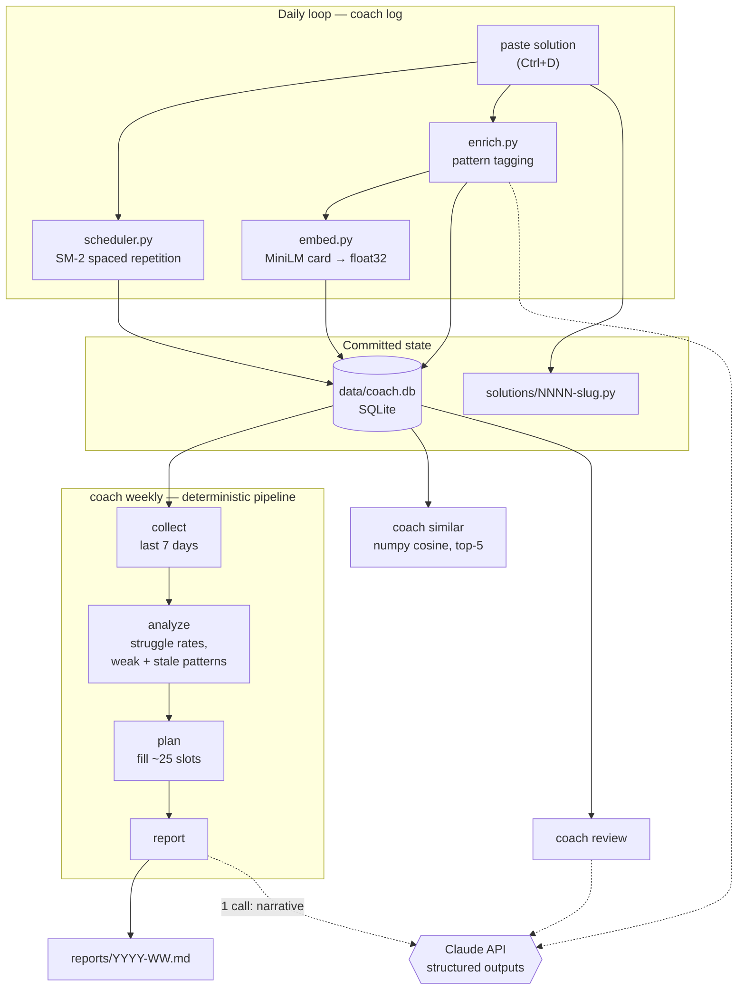

# leetcode-coach

A personal interview-prep coach that closes the loop on LeetCode practice: it remembers
what you solved and *how*, tells you when to re-solve it, retrieves your own past
solutions by algorithmic pattern, and plans each week around your measured weaknesses.

The practice problem it fixes: solving 20–30 problems a week leaks. There is no record
of which patterns are strong, no signal when a problem was "solved" without learning
what it teaches, and no schedule that brings a problem back before you forget it.

Everything the LLM does here is **measured**, not assumed — see
[Does it actually work?](#does-it-actually-work) below.

---

## Architecture



Solid arrows are local; dotted arrows are the only places an LLM is involved. Every one
of them degrades to a working non-LLM path when the API is unavailable.

---

## What it does

| Command | What it gives you |
|---|---|
| `coach log <n>` | Paste a solution → stores it, tags the pattern, embeds it, schedules the review, shows similar past solves, and flags the solve if you used the wrong approach |
| `coach due` | What to re-solve today, by spaced repetition |
| `coach similar <n>` / `--paste` | Your five most similar past solutions, by *algorithmic pattern* rather than text |
| `coach review <n>` | Structured feedback on a stored solution: complexity, bugs, edge cases, better approach |
| `coach stats` | Pattern coverage, struggle rates, off-pattern solves, curriculum progress |
| `coach weekly` | Writes `reports/YYYY-WW.md`: the week, the diagnosis, and next week's plan |
| `coach enrich` | Backfills tags and embeddings for anything logged while offline |

---

## Design decisions

**Two tag layers, because "solved" and "learned" are different questions.**
Each solution gets a `pattern` describing *the approach as written* — even when that
approach is a brute force. Each problem separately gets an `intended_pattern`: the
canonical optimal approach. Tagging your solution honestly is what keeps struggle
analytics truthful; if a brute-forced Maximum Subarray were filed under `dp-1d`, the
planner would never schedule the one thing you most need to learn. The **disagreement
between the layers** is the useful signal: it marks a problem you solved without
learning what it teaches, and the planner forces a re-solve.

**A controlled vocabulary of 26 patterns, enforced as a type.**
The model picks from an enum, so tags can never fragment into `dp`/`DP`/`dynamic
programming` and make coverage analytics meaningless. LeetCode's own tags are kept too,
but for the opposite job — they are coarse enough to *find new problems*, while our
vocabulary is fine enough to *diagnose weaknesses*.

**Embed an enriched card, not raw code.**
Each solution is embedded as `title + pattern + key trick + code`, so two problems that
share a technique retrieve each other even when they share no vocabulary. Measured, not
assumed: see the retrieval eval below (it wins, but only modestly).

**No vector database.**
Brute-force numpy cosine over float32 blobs in SQLite. At a few hundred solutions this
takes microseconds; a vector DB would be infrastructure bought to solve a problem this
project does not have.

**The weekly "agent" is a deterministic pipeline, not an agentic loop.**
collect → analyze → plan → report, with exactly one LLM call at the end for the
narrative. The steps are fixed and known in advance, which makes a pipeline more
testable and more robust than letting a model decide the control flow.

**Everything degrades.**
No API key, rate limit, refusal, or network failure ever loses a logged solve. `coach
log` stores the solution and queues enrichment; `coach weekly` writes the full report
minus the narrative and records `degraded = true`.

---

## Does it actually work?

The point of the eval harness is that "the feedback looked good" is not a claim you can
defend or iterate against. Full numbers and methodology: **[evals/RESULTS.md](evals/RESULTS.md)**.

### Review feedback — 43 fixtures

| Metric | Result |
|---|---|
| Recall on planted flaws | **97%** (29/30) |
| False-positive rate on clean controls | **0%** (13 controls) |
| By category | bug 94% · complexity 100% · edge-case 100% |

The false-positive rate matters as much as recall: a reviewer that reports five issues
on every solution scores perfect recall and is useless, because it would send you
re-solving problems you already got right.

**Ground truth comes from executing the code, never from an opinion.** Canonical
solutions are mutated using a taxonomy of common mistakes fixed in advance, then run
against a test harness. A mutant that fails a representative input is a `bug`; one that
fails only at a boundary is an `edge-case`; one that is correct but ≥5× slower at scale
is a `complexity` flaw; and one the tests cannot distinguish from the original is
**discarded**. That discard rule means weak tests cost fixtures rather than producing
mislabelled ones — the safe direction to fail. It also means the author of a planted
flaw is not the authority on whether it is real.

### The result worth reading

**Two prompt iterations produced no measurable improvement.** `review-v1` and
`review-v2` tie at 29/30; they differ only in *which* fixture they miss, and both misses
are the same defensible dispute about where "bug" ends and "edge-case" begins.

What actually moved the number from 93% to 97% was **fixing the eval** — three
independent defects in the ground truth, every one found because the model disagreed
with a label and the disagreement turned out to be its point:

1. Inputs marked as boundary cases that were nothing of the kind (different-length
   strings are an ordinary input to an anagram check).
2. Tests that violated the problem's own constraints — empty arrays fed to problems
   whose constraints state `1 <= length`. A defect on an input the problem excludes is
   not a defect. Removing those tests made three mutants indistinguishable from the
   original, and the oracle discarded them on its own.
3. A "clean" control that was not clean: it iterated `prices[1:]`, allocating an O(n)
   copy, and the model was scored as a false positive *for being right about it*.

### Pattern tagging and retrieval

| Eval | Result |
|---|---|
| `intended_pattern` vs NeetCode's published Blind 75 sections | **100%** (29 problems) |
| Retrieval recall@5 — enriched cards | **64%** |
| Retrieval recall@5 — raw code | 60% |

Enriched cards beat raw code by 5 points: a real win, but a **weak** one, and reported
as such. Both variants fail on the same cluster, where four labelled 1-D DP pairs
compete for five result slots in a corpus dense with DP problems.

Known limitations — small `edge-case` sample, an array/string/DP-only bank, and the
fact that mutation *choice* remains authored even though every label is executed — are
listed in [evals/RESULTS.md](evals/RESULTS.md#known-limitations).

---

## Quick start

Requires Python 3.12 and [uv](https://docs.astral.sh/uv/).

```bash
uv sync --extra embed          # omit --extra embed to skip torch (no local embeddings)
cp .env.example .env           # then add your key; .env is gitignored
uv run coach init              # download the catalog, create the database

uv run coach log 1 --outcome clean --time 8   # paste your solution, then Ctrl+D
uv run coach due
uv run coach similar 1
uv run coach weekly
```

Development:

```bash
uv run pytest                  # 60 tests; every LLM call mocked, API key stripped
uv run ruff check .
uv run python -m evals.validate_bank        # re-label the fixture bank, no API calls
uv run python -m evals.run_evals --all --dry-run   # count the calls and cost first
uv run python -m evals.run_evals --all             # real API calls
```

`--dry-run` always reports the exact number of uncached calls and an estimated cost
before anything is spent. Evals default to a cheaper model (`config.EVAL_MODEL`) because
they measure the *prompt*, not model capability; pass `--model claude-opus-5` to score
the model the coach itself uses. Responses cache by prompt version, model, and code
digest, so a repeat run costs nothing and correcting a *label* re-scores for free.

The database starts empty and grows from your first `coach log`. `data/coach.db` and
`solutions/` are committed on purpose: the state travels with the repo, and the commit
history doubles as the solve timeline.

---

## Automation

`coach weekly` ran on a schedule via GitHub Actions through M5; that workflow has since
been removed in favor of a systemd user timer that runs the same command weekly on the
machine that owns `data/coach.db` — one writer, no CI secret holding an API key it barely
used, and one less piece of infrastructure to keep working. The report is reviewed and
pushed by hand, alongside whatever other changes accumulated that week.

Unit files: `~/.config/systemd/user/coach-weekly.{service,timer}`.

## Layout

```
coach/          CLI, SQLite schema, scheduler, LLM wrapper, enrichment, embeddings
coach/weekly/   collect → analyze → plan → report
evals/          execution oracle, fixture bank, corpus, scorers, RESULTS.md
tests/          60 tests, no network
docs/PLAN.md    full design record and milestone history
```
