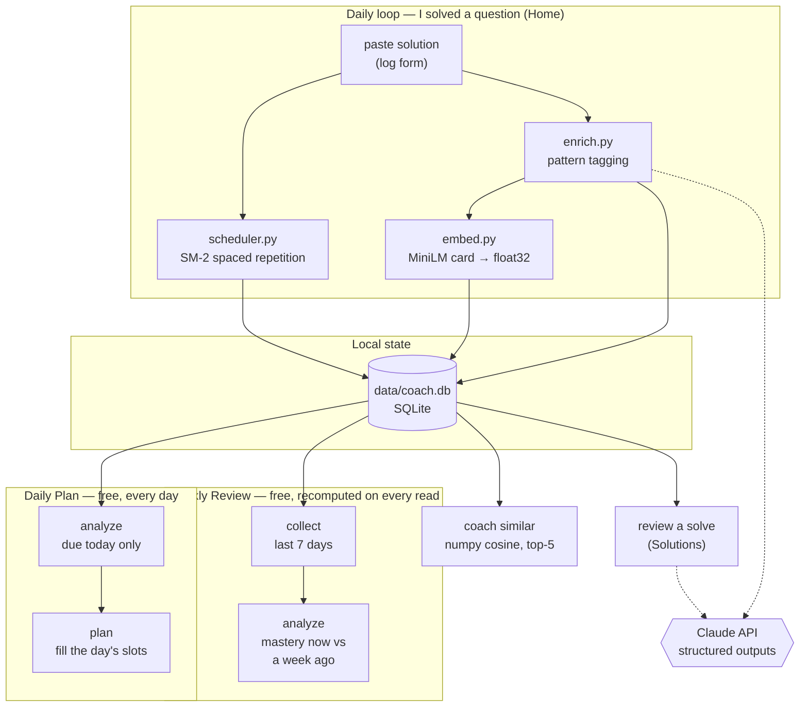

# Design record

Why this tool is built the way it is, and what was measured rather than assumed.
For installing and running it, see the [README](../README.md).

---

## Architecture



Solid arrows are local; dotted arrows are the only places an LLM is involved. Every one
of them degrades to a working non-LLM path when the API is unavailable.

The web UI is the daily interface; the CLI keeps only the jobs with no page (`init`,
`enrich`, `similar`). Both are thin layers over one implementation
([`coach/service.py`](../coach/service.py)), so they cannot drift into disagreeing.
Enrichment is the sharpest case: logging a solve and the `coach enrich` backfill both run
`service.tag_solution_now()`, and differ only in how they embed — one card per solve, or
one batch at the end.

---

## Design decisions

**Two tag layers, because "solved" and "learned" are different questions.**
Each solution gets a `pattern` describing *the approach as written* — even when that
approach is a brute force. Each problem separately gets an `intended_pattern`: the
canonical optimal approach. Tagging your solution honestly is what keeps struggle
analytics truthful; if a brute-forced Maximum Subarray were filed under `dp-1d`, the
planner would never schedule the one thing you most need to learn. The **disagreement
between the layers** is the useful signal: it marks a problem you solved without
learning what it teaches, and the planner forces a re-solve.

**A problem can have more than one canonical approach.**
Best Time to Buy and Sell Stock is a one-pass greedy *and* a textbook 1-D DP; solving it
either way is solving it properly. So a problem carries `intended_secondary_patterns`
alongside its central `intended_pattern`, feeding two signals. The sharp one,
*off-pattern*, fires only when a solve used **none** of the accepted approaches. The soft
one is a note ("this problem can also be solved with: dp-1d") shown on every solve, which
lists the canonical approaches you have not practised here. Both are set arithmetic over
columns the enrichment call already filled in, so they cost nothing. The accepted set
accumulates across enrichments, since the model does not name the same alternates every
time, so a solve is judged against the merged set the write returns, never against the
answer just received — otherwise one forgetful answer re-flags a solve the planner has
already cleared. Because the note is
computed when you look rather than frozen when the solve was stored, widening a problem's
canonical set later widens the note on old solves too.

**One mastery score per pattern, not a struggle rate.**
"Weak" used to mean *at least half the attempts were not clean* — a binary that read five
shaky-but-solved sweeps exactly like five failures. It now means a mastery score below
2.5/5 over at least five attempts. Each solve scores `0.7 · outcome + 0.3 · review`, on the
same 1–5 scale SM-2 already uses for scheduling: the outcome is self-report (how it felt),
the review is the external judgement on the code (a bug scores 1, a missed boundary 2, and
extra findings can only pull it down). They disagree often enough to be worth both — a solve
can feel clean and still carry a bug. Scores fold through an exponential moving average
(α = 0.2), so recent solves move the number without erasing history. Nothing about the
score is stored: every read replays the saved attempts and reviews, so a review — which
usually arrives days after the solve it judges — counts the moment it is saved, and no
writer has to remember to refresh a cache. That costs something, measured on synthetic
histories: the Weekly Review's read takes 0.2 ms at today's size, 7 ms at a year of 25
solves a week, and 83 ms at ten years, against 0.2, 6 and 60 ms for the cache it replaced.

**A controlled vocabulary of 26 patterns, enforced as a type.**
The model picks from an enum, so tags can never fragment into `dp`/`DP`/`dynamic
programming` and make coverage analytics meaningless. LeetCode's own tags are kept too,
but for the opposite job — they are coarse enough to *find new problems*, while our
vocabulary is fine enough to *diagnose weaknesses*.

**Embed an enriched card, not raw code.**
Each solution is embedded as `title + pattern + key trick + code`, so two problems that
share a technique retrieve each other even when they share no vocabulary. Measured, not
assumed: see the retrieval eval below — it wins, but only modestly.

**No vector database.**
Brute-force numpy cosine over float32 blobs in SQLite. At a few hundred solutions this
takes microseconds; a vector DB would be infrastructure bought to solve a problem this
project does not have.

**One copy of everything.**
`coach.db` is the only place a solve lives. Two mirrors have been removed for the same
reason: a per-problem `solutions/NNNN-slug.py` file, and a frozen weekly report. Both were
written on every update and read by nothing inside the application, and a second copy that
nobody reads is a second copy that can be wrong. The same rule retired the daily CLI
commands: every daily feature existed as a service function, a CLI printer and a web page,
and once the page could do everything the printer did, nobody read the printer.

**Nothing about the week is written down.**
The Weekly Review page runs its SQL on demand, so the week is correct by construction
rather than as of whenever it was last generated. The frozen snapshot it replaced was
stale the moment the next problem was solved, and the LLM narrative beside it restated
numbers the tables already showed.

**Comparison instead of narration.**
The question that narrative was there to answer — *is this pattern getting better?* — is a
subtraction, not a paragraph. Mastery is already a replay of every scored attempt, so
the same replay over only the attempts before the window gives what the pattern scored
a week ago, and the difference is the answer. It is exact, it costs nothing, and unlike
prose it cannot be vague.

**Everything degrades.**
No API key, rate limit, refusal, or network failure ever loses a logged solve. Logging
stores the solution and queues enrichment, then `coach enrich` backfills the tags and
embeddings later. Only enrichment and reviews ever call the API at all.

---

## No automation, by design

Nothing here runs unattended. There is no cron job, no systemd timer, and no scheduled
writer, because there is nothing left to schedule: the weekly review is computed the
moment you ask for it, from the database, in a few milliseconds.

That is the second time this project has arrived at *pull, don't push*. A GitHub Actions
cron wrote the report first, and was dropped because it meant leaving a live API key and
an automated writer on a repo run by hand. The systemd timer that replaced it then proved
the point on its own: it fired on a Sunday with no network, wrote a report missing the
one part that needed the network, and overwrote that week's good one. Removing the stored
report removed the last thing a scheduler was for.

---

## Does it actually work?

The point of the eval harness is that "the feedback looked good" is not a claim you can
defend or iterate against. Full numbers and methodology:
**[evals/RESULTS.md](../evals/RESULTS.md)**.

### Review feedback — 43 fixtures

| Metric | Result |
|---|---|
| Recall on planted flaws | **97%** (29/30) |
| False-positive rate on clean controls | **0%** (13 controls) |
| By category | bug 94% · complexity 100% · edge-case 100% |

These numbers were measured on `review-v2`. The shipped prompt is now `review-v3`, which
adds a `strengths` field so a review also says what the solution got right; its
issue-detection has not been re-scored, and the table stands as a v2 result until it is.

The false-positive rate matters as much as recall: a reviewer that reports five issues
on every solution scores perfect recall and is useless, because it would send you
re-solving problems you already got right.

**Ground truth comes from executing the code, never from an opinion.** Canonical
solutions are mutated using a taxonomy of common mistakes fixed in advance, then run
against a test harness. A mutant that fails a representative input is a `bug`; one that
fails only at a boundary is an `edge-case`; one that is correct but ≥5× slower at scale
is a `complexity` flaw; and one the tests cannot distinguish from the original is
**discarded**. That discard rule means weak tests cost fixtures rather than producing
mislabelled ones — the safe direction to fail. It also means the author of a planted
flaw is not the authority on whether it is real.

### The result worth reading

**Two prompt iterations produced no measurable improvement.** `review-v1` and
`review-v2` tie at 29/30; they differ only in *which* fixture they miss, and both misses
are the same defensible dispute about where "bug" ends and "edge-case" begins.

What actually moved the number from 93% to 97% was **fixing the eval** — three
independent defects in the ground truth, every one found because the model disagreed
with a label and the disagreement turned out to be its point:

1. Inputs marked as boundary cases that were nothing of the kind (different-length
   strings are an ordinary input to an anagram check).
2. Tests that violated the problem's own constraints — empty arrays fed to problems
   whose constraints state `1 <= length`. A defect on an input the problem excludes is
   not a defect. Removing those tests made three mutants indistinguishable from the
   original, and the oracle discarded them on its own.
3. A "clean" control that was not clean: it iterated `prices[1:]`, allocating an O(n)
   copy, and the model was scored as a false positive *for being right about it*.

Because that is where the value turned out to be, a miss in the report now carries the
execution evidence behind its label, so the next disagreement can be adjudicated rather
than merely counted.

### Pattern tagging and retrieval

| Eval | Result |
|---|---|
| `intended_pattern` vs NeetCode's published Blind 75 sections (measured on `enrich-v2`) | **100%** (29 problems) |
| Retrieval recall@5 — enriched cards | **64%** |
| Retrieval recall@5 — raw code | 60% |

Enriched cards beat raw code by 5 points: a real win, but a **weak** one, and reported
as such. Both variants fail on the same cluster, where four labelled 1-D DP pairs
compete for five result slots in a corpus dense with DP problems.

Known limitations — small `edge-case` sample, an array/string/DP-only bank, and the
fact that mutation *choice* remains authored even though every label is executed — are
listed in [evals/RESULTS.md](../evals/RESULTS.md#known-limitations).

### Running the evals

```bash
uv run python -m evals.validate_bank               # re-label the fixture bank, no API calls
uv run python -m evals.run_evals --all --dry-run   # count the calls and the cost first
uv run python -m evals.run_evals --all             # real API calls, roughly $2
```

`--dry-run` counts the calls a real run would make with the same code that buys them, so
the two cannot disagree. Responses cache by prompt version, model, and a digest of the
code they scored, so a repeat run costs nothing, correcting a *label* re-scores for free,
and editing a *fixture* re-buys just that fixture.

---

## Layout

```
coach/          CLI, service layer, SQLite schema, scheduler, LLM wrapper, enrichment, embeddings
coach/weekly/   collect → analyze (plan.py builds the daily list)
coach/web/      FastAPI app + the static Home, Solutions, Daily Plan and Weekly Review pages
evals/          execution oracle, fixture bank, corpus, scorers, RESULTS.md
tests/          the whole suite, no network
docs/DESIGN.md  this file
```
