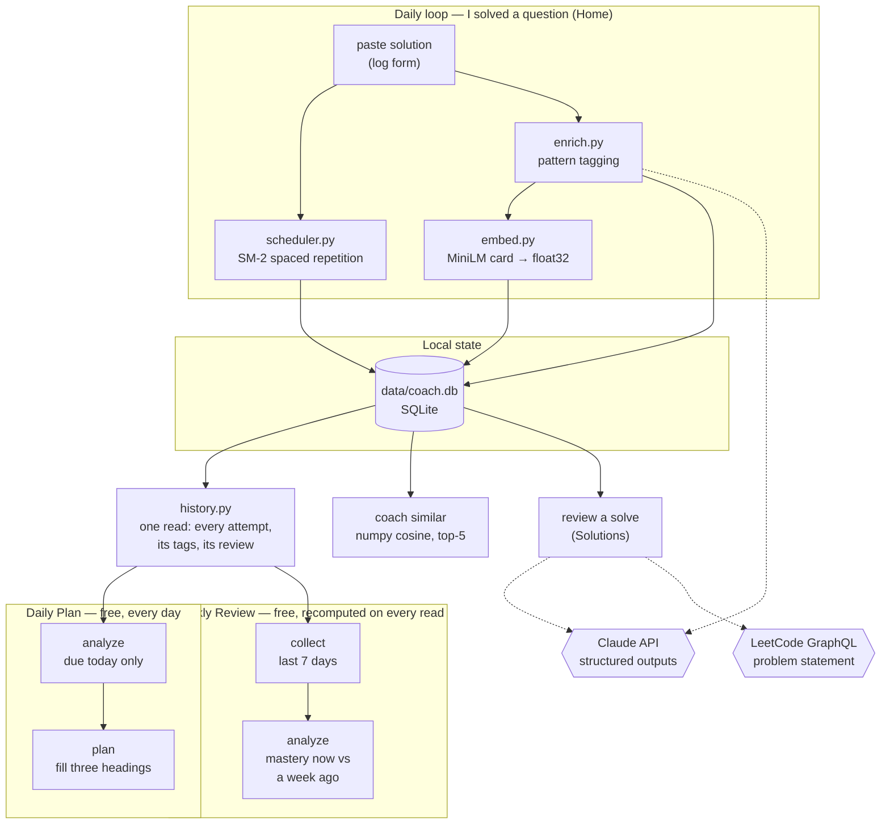

# Design record

Why this tool is built the way it is, and what was measured rather than assumed.
For installing and running it, see the [README](../README.md).

---

## Architecture



Solid arrows stay on the machine; dotted arrows leave it — the Claude API for enrichment
and reviews, LeetCode for a problem's statement. Every one of them degrades to a working
local path when the network or the key is unavailable.

The web UI is the daily interface; the CLI keeps only the jobs with no page (`init`,
`enrich`, `similar`). Both are thin layers over one implementation
([`coach/service.py`](../coach/service.py)), so they cannot drift into disagreeing.
Enrichment is the sharpest case: logging a solve and the `coach enrich` backfill both run
`service.tag_solution_now()`, and differ only in how they embed — one card per solve, or
one batch at the end.

---

## Design decisions

**Two tag layers, because "solved" and "learned" are different questions.**
Each solution gets `main_patterns` describing *the approach as written* — even when that
approach is a brute force. Usually that is one pattern; a solution genuinely built on two
(a memoized DFS computing a knapsack recurrence) gets both, and they are equal: the solve
is an attempt of each at its full score, never split between them or credited to
whichever the model named first. Patterns a solution merely leans on go in
`secondary_patterns`, which count toward the off-pattern check below but never toward
mastery or the pattern table — a row there always describes solves that pattern was built
into. Each problem separately gets an `intended_pattern`: the canonical optimal approach.
Tagging your solution honestly is what keeps struggle analytics truthful; if a
brute-forced Maximum Subarray were filed under `dp-1d`, the planner would never schedule
the one thing you most need to learn. The **disagreement between the layers** is the
useful signal: it marks a problem you solved without learning what it teaches, and that
problem owes approach practice until you show you have (below).

**A problem can have more than one canonical approach.**
Best Time to Buy and Sell Stock is a one-pass greedy *and* a textbook 1-D DP; solving it
either way is solving it properly. So a problem carries `intended_secondary_patterns`
alongside its central `intended_pattern`, feeding two signals. The sharp one,
*off-pattern*, fires only when a solve used **none** of the accepted approaches. The soft
one is a note ("this problem can also be solved with: dp-1d") shown on every solve, which
lists the canonical approaches you have not practised here. Both are set arithmetic over
columns the enrichment call already filled in, so they cost nothing. The accepted set
accumulates across enrichments, since the model does not name the same alternates every
time, so a solve is judged against the merged set the write returns, never against the
answer just received — otherwise one forgetful answer re-flags a solve that had already
completed its approach practice. Because the note is
computed when you look rather than frozen when the solve was stored, widening a problem's
canonical set later widens the note on old solves too.

**Approach practice closes on a demonstrated success, not on a tag.**
An off-pattern solve used to put its problem on the Daily Plan every day until any stored
solution carried an accepted tag — so a failed attempt, one that needed hints, or one whose
review found a bug all cleared it, while a problem practised yesterday came straight back
this morning. It is now three questions, recomputed from the history on every read
([`coach/corrections.py`](../coach/corrections.py)). A solve is *off-pattern* when its tags
name none of the accepted approaches. *Approach practice is outstanding* while some solve
was off-pattern and no attempt **qualifies**: one attempt that used an accepted approach on
a day that was not a failure day. A failure day is the line SM-2 already lapses a day on —
something that day failed, needed hints, or has a review reporting a bug, an edge case or
needs-work — so a clean retry typed in right after a failure completes nothing, for the same
reason it does not stretch the schedule. The tags and the success must be one attempt's: a
failed DP solve beside a clean brute force is never "solved with DP". *It is due* three days
after the latest attempt of any kind, so practising a problem, however it went, never brings
it back the next day, and a review or a late tag that reopens it is due three days after the
practice it judges — usually already past — not three days after you read it. One qualifying
attempt closes it for good: brute-forcing the problem again later is an experiment, and
forgetting the approach is SM-2's job. An untagged solve is neither evidence nor success
until `coach enrich` tags it, though it still moves the date, because it was practice. On
the Daily Plan a problem owed both a review and approach practice is one item under Due
carrying both reasons. Completing approach practice never advances the review: a success before the review
is due leaves its date where it was (below), so the review can also come due first, and each
is then listed on its own date.

**One mastery score per pattern, not a struggle rate.**
"Weak" used to mean *at least half the attempts were not clean* — a binary that read five
shaky-but-solved sweeps exactly like five failures. It now means a mastery score below
2.5/5 across at least five distinct problems. The floor counts problems, not attempts: SM-2
re-queues a failed problem every three days, so one hard problem could pile up five attempts
on its own, and that says something about the problem, which SM-2 already handles, not about
the pattern. Each solve scores `0.7 · outcome + 0.3 · review`, on the
same 1–5 scale SM-2 already uses for scheduling: the outcome is self-report (how it felt),
the review is the external judgement on the code (a bug scores 1, a missed boundary 2, and
extra findings can only pull it down). They disagree often enough to be worth both — a solve
can feel clean and still carry a bug. The blend is then capped by what the attempt earned
(`assessment.effective_quality`): never above its outcome, and never above 1 when its review
reports a bug or 2 when it reports a missed boundary. Blending alone scored a clean solve
with a reported bug 3.8, so no number of them could make a pattern weak, and let an optimal
review lift a solve that needed hints to 2.9. A review is a model's judgement, not an
executed test, so it only ever lowers a grade; the ceilings are a policy, not a calibrated
prediction. Scores fold through an exponential moving average
(α = 0.2), so recent solves move the number without erasing history. Nothing about the
score is stored: every read replays the saved attempts and reviews, so a review — which
usually arrives days after the solve it judges — counts the moment it is saved, and no
writer has to remember to refresh a cache. That costs something, measured on synthetic
histories: the Weekly Review's read takes 0.2 ms at today's size, 7 ms at a year of 25
solves a week, and 83 ms at ten years, against 0.2, 6 and 60 ms for the cache it replaced.

**One review per day, graded by its worst attempt, and none before it is due.**
A review is only worth scheduling from if it tested memory, and counting every logged solve
as one did not: solving a problem three times in one sitting stepped its schedule 7 → 14 →
39 days, and a clean retry typed in right after reading the solution passed for a month of
retention. So a problem's attempts on the same day are one SM-2 review, graded by the worst
of them. Every attempt is still stored; only the schedule reads the day once. A failure
grades its day whichever order it came in, because it is real evidence, but three failed
tries lapse the problem once rather than flooring its ease and shortening every interval
after it. The same stretch survived across days: three clean solves on consecutive days still
reached 39 days, and approach practice — owed three days after an off-pattern solve, four
before its review — stepped the review to 14 days from the practice, though it tested nothing
about remembering. So a passing day counts only once its review is due
(`scheduler.counts_as_review()`); before that it changes nothing, not even the ease. A failing
day always counts, however early, because forgetting is evidence whenever it shows, and
reviews taken on their due dates schedule exactly as before. The stored schedule is a replay of the attempts (`scheduler.replay()`), not a
running total stepped once per solve, so the rule has one owner, and `coach init` re-derives
every stored schedule when the rule changes.

**A review re-grades the attempt it judges; it is never a review of its own.**
The schedule used to ignore reviews, so a clean solve whose review reported a bug stayed a
week away while its pattern's mastery counted the bug. Now each attempt is scheduled by the
same capped grade mastery uses, and saving or refreshing a review replays the problem's
history in the transaction that stores it. It is not a failure appended on the day the
review arrives: re-running a review would count the same evidence twice, and the schedule
would depend on when you happened to click. A bug found ten days after a solve lapses the
problem three days after the solve — already overdue, so it is owed now — and a clean solve
logged in between still counts after it. An optimal review never upgrades a failed attempt.
On the Daily Plan that problem reads "re-solve: review reported a bug" rather than a bare
date, judged by its last practice day, so a clean retry the same afternoon hides the reason
no more than it undoes the lapse.

**The reviewer reads the problem statement, fetched once per problem.**
`review-v4` fixed a class of false positives by telling the model to judge issues against
the problem's stated constraints and guarantees — an input the constraints exclude is not
a flaw, and a faster algorithm that makes no difference at the allowed sizes is not an
improvement. But it was given only a number and a title to recall those constraints from,
so the rule pointed at text the prompt never contained. `review-v5` supplies it: LeetCode's
statement, cleaned to plain text and cached in `problems.content`. The fetch is one GraphQL
call made by the first review that needs it, not part of the bulk catalog fetch, so a
problem never reviewed never costs a request. An empty cell means never fetched *or* the
fetch failed, so an unreachable LeetCode does not ban a problem from constraints text for
good, and paid-only problems are never attempted, because the public API withholds the
field for them — answering 200 with it null, which is why a malformed answer reads as
absent rather than raising. The statement is an input the prompt can do without: with none,
`review-v5` tells the model to fall back on what it knows of this problem's actual
constraints rather than a generic worst case, so a failed fetch costs one review some
precision instead of the review itself. The column arrives through the guarded
`ALTER TABLE` in `init_schema`, so a database carried over from before it needs one
`coach init`. **The eval numbers below do not measure this**: they were bought under
`review-v4`, and the fixture bank's test split was already spent on it.

**The Daily Plan is three headings of ten, not one list of fifteen.**
It used to be one ranked list sharing fifteen slots: due reviews, then due approach practice,
then weak-pattern picks, then curriculum progression. A heavy review day pushed everything
after it off the page, and nothing said so. Now each kind of work has its own heading and its
own budget of `SECTION_LIMIT` (10): **Due**, **Approach practice** and **Weak patterns**,
filled in that order. Approach practice fills before weak picks because it is owed on a
problem already solved the wrong way, while a weak pick is a new, optional problem, so only
new picks meet the one-in-five Hard cap, counted per heading. Curriculum progression is not a
heading of its own: it tops Due up when fewer than ten reviews are due, and it runs last, so it
never takes a problem a weak pattern would have picked. Due claims every review due, even one
that does not fit. That review stays overdue, comes first tomorrow, and the heading says how
many it left out, instead of letting it resurface under Approach practice without its review.

**A controlled vocabulary of 26 patterns, enforced as a type.**
The model picks from an enum, so tags can never fragment into `dp`/`DP`/`dynamic
programming` and make coverage analytics meaningless. LeetCode's own tags are kept too,
but for the opposite job — they are coarse enough to *find new problems*, while our
vocabulary is fine enough to *diagnose weaknesses*.

**Embed an enriched card, not raw code.**
Each solution is embedded as `title + main patterns + key trick + code`, so two problems
that share a technique retrieve each other even when they share no vocabulary; after a
solve is logged, similar past solves are those sharing any of its main patterns. Measured,
not assumed: see the retrieval eval below — it wins by 17 points on `enrich-v5`, up from 5
on `enrich-v2`.

**One vector per solve, not one per problem.**
Embeddings are keyed by `solution_id`. Re-solving a problem a different way — Best Time to
Buy and Sell Stock as `greedy`, then again as `dp-1d` — embeds a new card for the new solve
and leaves the old solve's vector untouched, so the problem now has two vectors and can be
retrieved through either approach. Search filters solve by solve and keeps each problem's
best score, so a `greedy` query reaches it through the greedy solve and a `dp-1d` query
through the DP one. The hit names the solve that matched, and is shown with that solve's
patterns and key trick: describing it by the problem's latest solve labelled a match found
through the DP solve as greedy. The asking side works the same way — `coach similar
<number>` queries with every solve of the problem, so a problem solved both ways finds the
relatives of both approaches instead of only the latest one's. Keeping a single vector per problem — the latest solve's, or an average
of all of them — would leave it findable through one approach at most, which throws away
exactly the variety that re-solving a problem a new way is meant to build. A stored vector
changes only when its own solve is re-tagged. The card names the solve's main patterns, so
saving new tags discards the vector in the same commit, and the next `coach enrich` rebuilds
every missing one. The rebuild used to be the re-tag's own job, and a re-tag whose embedding
failed left the old vector searchable under the new tags, where a plain `coach enrich` —
looking only for solves with no vector — never found it. A missing vector is a state that
repairs itself; a stale one was not.

**No vector database.**
Brute-force numpy cosine over float32 blobs in SQLite. At a few hundred solutions this
takes microseconds; a vector DB would be infrastructure bought to solve a problem this
project does not have.

**One read of the practice history, and pure functions over it.**
Four things ask the database the same question — what mastery folds, what approach practice
is owed, what SM-2 replays, and why a problem came back — and each used to ask it with its
own join, its own JSON decoding and its own choice of inner or left join. The grade formula
already had one owner ([`coach/assessment.py`](../coach/assessment.py)), but the *evidence*
it graded did not, so a change to how a review attaches to an attempt meant editing four
queries in four modules, and missing one brought back exactly the disagreement assessment.py
was written to end — silently, with nothing to fail. The join now lives once, in
[`coach/history.py`](../coach/history.py). An attempt is the whole row: the attempt as
logged, the solve's tags when it has been tagged, and the review of that solve when one was
bought, with its grade and its correctness finding derived through assessment.py rather than
stored. Attempts drive the join and everything else is left-joined, because a solve logged
before enrichment ran is still practice that happened and dropping it would quietly change
what the schedule replays; an untagged solve reads as unknown, which is never evidence, and
not as an empty list. Mastery, approach practice, findings and the weekly window are then
pure functions over the attempts, and one request loads them once and hands the same list to
all four. Nothing is cached, for the reason nothing else here is: a review saved days after
the solve it judges, or a tag backfilled by `coach enrich`, counts on the next read.

**One copy of everything.**
`coach.db` is the only place a solve lives. Two mirrors have been removed for the same
reason: a per-problem `solutions/NNNN-slug.py` file, and a frozen weekly report. Both were
written on every update and read by nothing inside the application, and a second copy that
nobody reads is a second copy that can be wrong. The same rule retired the daily CLI
commands: every daily feature existed as a service function, a CLI printer and a web page,
and once the page could do everything the printer did, nobody read the printer.

**Nothing about the week is written down.**
The Weekly Review page runs its SQL on demand, so the week is correct by construction
rather than as of whenever it was last generated. The frozen snapshot it replaced was
stale the moment the next problem was solved, and the LLM narrative beside it restated
numbers the tables already showed.

**Comparison instead of narration.**
The question that narrative was there to answer — *is this pattern getting better?* — is a
subtraction, not a paragraph. Mastery is already a replay of every scored attempt, so
the same replay over only the attempts before the window gives what the pattern scored
a week ago, and the difference is the answer. It is exact, it costs nothing, and unlike
prose it cannot be vague.

**Everything degrades.**
No API key, rate limit, refusal, or network failure ever loses a logged solve. Logging
stores the solution and queues enrichment, then `coach enrich` backfills the tags and
embeddings later. Only enrichment and reviews ever call the API at all.

---

## No automation, by design

Nothing here runs unattended. There is no cron job, no systemd timer, and no scheduled
writer, because there is nothing left to schedule: the weekly review is computed the
moment you ask for it, from the database, in a few milliseconds.

That is the second time this project has arrived at *pull, don't push*. A GitHub Actions
cron wrote the report first, and was dropped because it meant leaving a live API key and
an automated writer on a repo run by hand. The systemd timer that replaced it then proved
the point on its own: it fired on a Sunday with no network, wrote a report missing the
one part that needed the network, and overwrote that week's good one. Removing the stored
report removed the last thing a scheduler was for.

---

## Does it actually work?

The point of the eval harness is that "the feedback looked good" is not a claim you can
defend or iterate against. Full numbers and methodology:
**[evals/RESULTS.md](../evals/RESULTS.md)**.

### Review feedback — 25 problems it was never tuned on

| Metric | Result |
|---|---|
| Recall on planted flaws | **82%** (59/72; 95% CI 72–89%) |
| False-positive rate on clean controls | **20%** (10/49; 95% CI 12–34%) |
| By category | bug 75% · complexity 90% · edge-case 100% |
| The same prompt on the 13 problems it was written against | 97% recall · 0% false positives (0/35) |

Measured on `review-v4` with `claude-sonnet-5`, on the held-out `test` split of the fixture
bank: 3 Easy, 14 Medium and 8 Hard problems, with every correct solution written outside
this repo. The model is the one the coach ships; the prompt is one version behind it.
`review-v5` adds the problem statement (above) and has no number of its own, because
reading this split's misses is what spent it — scoring v5 honestly needs new test problems,
so until they exist these are v4's numbers and are quoted as such.

The false-positive rate matters as much as recall: a reviewer that reports five issues
on every solution scores perfect recall and is useless, because it would send you
re-solving problems you already got right.

**Ground truth comes from executing the code, never from an opinion.** Canonical
solutions are mutated using a taxonomy of common mistakes fixed in advance, then run
against a test harness. A mutant that fails a representative input is a `bug`; one that
fails only at a boundary is an `edge-case`; one that is correct but ≥5× slower at scale
is a `complexity` flaw; and one the tests cannot distinguish from the original is
**discarded**. That discard rule means weak tests cost fixtures rather than producing
mislabelled ones — the safe direction to fail. It also means the author of a planted
flaw is not the authority on whether it is real.

**Labels are proven, not just tested.** A handful of hand-written tests can let a broken
mutant through, so every problem also carries a brute force written to be obviously right
and a generator of the random inputs its constraints allow. Code that passes the tests but
disagrees with the brute force on any of up to a thousand generated inputs stops the bank
with `TestsTooWeak` until a test covers that input.

**Clean controls are held to the same standard, and the test split's were written
elsewhere.** A control must pass every test, agree with the brute force, time within 5× of
the canonical, and not need megabytes where the canonical needs almost none. The test
split's come from NeetCode's and walkccc's published solutions, copied unmodified at pinned
commits - one that breaks a rule is rejected with its reason, never fixed (67 accepted, 50
rejected) - and from the author's own clean solves, kept out of git. A false-positive line
in the report quotes the model's claim, because on code proven correct the claim is the part
worth arguing with - but on the author's own solves that claim can quote the solution, so
those lines keep only their categories and the words stay in the gitignored cache. Controls
written in this repo count only on `dev`, where six that probe false positives an earlier
run showed are scored apart so they cannot flatter the rate.

**The test split is held out by construction.** The 47 problems added for it were divided
mechanically - within each difficulty, sorted by number, alternating - and the whole bank,
tests and mutants included, was committed before any review call on it. Its misses and
false positives stay out of the report until `--reveal-test`, because reading them is how a
prompt gets tuned to them.

### The result worth reading

**Two prompt iterations produced no measurable improvement.** `review-v1` and
`review-v2` tie at 29/30; they differ only in *which* fixture they miss, and both misses
are the same defensible dispute about where "bug" ends and "edge-case" begins.

What actually moved the number from 93% to 97% was **fixing the eval** — three
independent defects in the ground truth, every one found because the model disagreed
with a label and the disagreement turned out to be its point:

1. Inputs marked as boundary cases that were nothing of the kind (different-length
   strings are an ordinary input to an anagram check).
2. Tests that violated the problem's own constraints — empty arrays fed to problems
   whose constraints state `1 <= length`. A defect on an input the problem excludes is
   not a defect. Removing those tests made three mutants indistinguishable from the
   original, and the oracle discarded them on its own.
3. A "clean" control that was not clean: it iterated `prices[1:]`, allocating an O(n)
   copy, and the model was scored as a false positive *for being right about it*.

Because that is where the value turned out to be, a miss in the report now carries the
execution evidence behind its label, so the next disagreement can be adjudicated rather
than merely counted.

**Then a model switch broke the false-positive rate, and the eval caught it.** Moving to
`claude-sonnet-5` with `review-v3` kept recall at 29/30 but took false positives from 0/13
to 3/13: "an empty list raises IndexError" on problems whose constraints rule an empty
input out, and "O(n) is not optimal" for Climbing Stairs at `n <= 45`. That is not
cosmetic - a reported edge case caps an attempt's grade below SM-2's passing line, so a
correct solve would lapse. Thirteen controls could not have measured a fix (0/13 still
allows a true rate near 23%), so the bank grew to 35 clean controls first. The unchanged
prompt scored 4/35 there; `review-v4` added one rule - judge against the problem's stated
constraints and guarantees, and ignore faster algorithms that make no difference at the
allowed sizes - and scored 0/35 with recall unchanged. Every false positive went and none
appeared, but four fixtures in one run is suggestive rather than conclusive; RESULTS.md
has the caveats.

**Then a held-out split showed the tuned numbers do not transfer.** On 25 problems no
prompt had been written against, the same prompt caught 82% of planted flaws and flagged
20% of correct solutions - against 0/35 on the tuned problems, Fisher exact p = 0.004.
Reading the revealed lines splits that 20% in two. Eight of the ten claims are
defensible: extra space that the canonical solution uses too, which the oracle measures
only relatively, and recursion deeper than CPython's default limit, which the oracle
raises. So "clean" has to mean optimal before that rate is the reviewer's alone. The
misses are the reviewer's: eight bugs that fail one of LeetCode's own examples, each a
small edit to a famous published solution, drew no comment at all.

### Pattern tagging and retrieval

| Eval | Result |
|---|---|
| `intended_pattern` vs NeetCode's published Blind 75 sections (`enrich-v5`) | **97%** (29 problems) |
| Retrieval recall@5 — enriched cards | **79%** |
| Retrieval recall@5 — raw code | 62% |

Enriched cards beat raw code by 17 points on `enrich-v5`, up from 5 on `enrich-v2`: one
run on 42 pair directions, so read it as a clear direction more than a precise size. The
misses that remain cluster where this small corpus is dense - 1-D DP problems, and a
graph/tree trio - with several labelled pairs competing for five result slots.

Known limitations — "clean" measured against the canonical rather than the optimum, small
`edge-case` samples, a bank of plain-value problems, controls that cluster on a few
problems, and the fact that mutation *choice* remains authored even though every label is
executed — are listed in [evals/RESULTS.md](../evals/RESULTS.md#known-limitations).

### Running the evals

```bash
uv run python -m evals.validate_bank                        # prove every label and control, no API calls
uv run python -m evals.run_evals --all --dry-run            # count the calls and the cost first
uv run python -m evals.run_evals --feedback --split test    # the held-out split: 121 calls, about $3
uv run python -m evals.run_evals --feedback --split test --reveal-test   # free from the cache; spends the split
```

`--dry-run` counts the calls a real run would make with the same code that buys them, so
the two cannot disagree. Responses cache by prompt version, model, and a digest of the
code they scored, so a repeat run costs nothing, correcting a *label* re-scores for free,
and editing a *fixture* re-buys just that fixture.

Published solutions enter through `python -m evals.bank.import_external fetch <n>` and
`judge`, which record every rejection with its reason; your own clean solves through
`python -m evals.bank.import_private --db <copy of coach.db>`, into a gitignored store.

---

## Layout

```
coach/          CLI, service layer, SQLite schema, scheduler, LLM wrapper, enrichment, embeddings
coach/history.py  the one read of practice history; mastery, corrections, assessment are pure over it
coach/weekly/   collect → analyze (plan.py builds the daily list)
coach/web/      FastAPI app + the static Home, Solutions, Daily Plan and Weekly Review pages
evals/          execution oracle, fixture bank, corpus, scorers, RESULTS.md
tests/          the whole suite, no network
docs/DESIGN.md  this file
```
